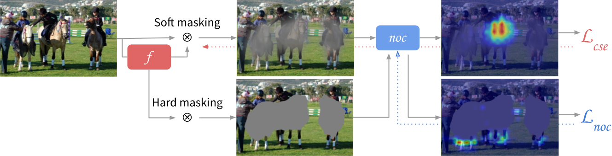

# P-NOC: Adversarial CAM Generation for Weakly Supervised Semantic Segmentation

## Introduction

This respository contains the official implementation for the paper "P-NOC: Adversarial Training of CAM Generating Networks for Robust Weakly Supervised Semantic Segmentation Priors".



In summary, P-NOC is trained by alternatively optimizing two objectives:
```math
\begin{align}
    \mathcal{L}_f &= \mathbb{E}_{(x,y)\sim\mathcal{D},r\sim y}[\mathcal{L}_\text{P} + \lambda_\text{cse}\ell_\text{cls}(p^\text{oc}, y\setminus\{r\})] \\
    \mathcal{L}_\text{noc} &= \mathbb{E}_{(x,y)\sim\mathcal{D},r\sim y}[\lambda_\text{noc}\ell_\text{cls}(p^\text{noc}, y)]
\end{align}
```
where $`\mathcal{L}_\text{P}`$ is the Puzzle-CAM regularization and $`p^\text{noc} = oc(x \circ (1 - \psi(A^r) > \delta_\text{noc}))`$.

## Results
### Pascal VOC 2012 (test)

| Method | bg | a.plane | bike | bird  | boat  | bottle | bus   | car   | cat   | chair | cow   | d.table | dog   | horse | m.bike | person | p.plant | sheep | sofa  | train | tv | Overall |
| --- | --- | --- | --- | --- | --- | --- | --- | --- | --- | --- | --- | --- | --- | --- | --- | --- | --- | --- | --- | --- | --- | --- |
| P-OC | 91.6 | 86.7 | 38.3 | 89.3 | 61.1 | 74.8 | 92.0 | 86.6 | 89.9 | 20.5 | 85.8 | 57.0 | 90.2 | 83.5 | 83.4 | 80.8 | 68.0 | 87.0 | 47.1 | 62.8 | 43.1 | 72.4 |
| P-NOC | 91.7 | 87.9 | 38.1 | 80.9 | 66.1 | 69.8 | 93.8 | 86.4 | 93.2 | 37.4 | 83.6 | 60.9 | 92.3 | 84.7 | 83.8 | 80.5 | 62.3 | 81.9 | 53.1 | 77.7 | 36.7 | 73.5 |

### MS COCO 2014 (val)

| Method | bg | person | bicycle | car | motorcycle | airplane | bus | train | truck | boat | traffic light | fire hydrant | stop sign | parking meter | bench | bird | cat | dog | horse | sheep | cow | elephant | bear | zebra | giraffe | backpack | umbrella | handbag | tie | suitcase | frisbee | skis | snowboard | sports ball | kite | baseball bat | baseball glove | skateboard | surfboard | tennis racket | bottle | wine glass | cup | fork | knife | spoon | bowl | banana | apple | sandwich | orange | broccoli | carrot | hot dog | pizza | donut | cake | chair | couch | potted plant | bed | dining table | toilet | tv | laptop | mouse | remote | keyboard | cell phone | microwave | oven | toaster | sink | refrigerator | book | clock | vase | scissors | teddy bear | hair drier | toothbrush | Overall |
| --- | --- | --- | --- | --- | --- | --- | --- | --- | --- | --- | --- | --- | --- | --- | --- | --- | --- | --- | --- | --- | --- | --- | --- | --- | --- | --- | --- | --- | --- | --- | --- | --- | --- | --- | --- | --- | --- | --- | --- | --- | --- | --- | --- | --- | --- | --- | --- | --- | --- | --- | --- | --- | --- | --- | --- | --- | --- | --- | --- | --- | --- | --- | --- | --- | --- | --- | --- | --- | --- | --- | --- | --- | --- | --- | --- | --- | --- | --- | --- | --- | --- | --- |
| P-NOC | 81.8 | 55.1 | 55.3 | 47.4 | 70.3 | 56.3 | 76.8 | 68.4 | 54.6 | 49.0 | 46.6 | 77.4 | 74.4 | 71.5 | 40.4 | 62.3 | 76.5 | 76.1 | 68.1 | 75.3 | 78.5 | 80.6 | 85.0 | 80.7 | 73.6 | 28.0 | 63.3 | 14.4 | 15.5 | 54.1 | 50.4 | 8.2 | 42.7 | 54.5 | 46.3 | 19.1 | 14.2 | 26.5 | 34.9 | 20.0 | 40.0 | 42.7 | 36.2 | 23.2 | 27.8 | 17.3 | 16.6 | 62.9 | 53.3 | 46.4 | 62.1 | 41.1 | 28.4 | 55.1 | 62.7 | 66.4 | 54.3 | 25.2 | 34.3 | 25.4 | 44.5 | 13.7 | 65.1 | 40.7 | 55.9 | 23.2 | 30.0 | 60.1 | 65.5 | 46.4 | 36.2 | 36.5 | 34.4 | 27.7 | 37.9 | 25.3 | 35.8 | 54.1 | 71.8 | 29.1 | 37.3 | 47.7 |

## Setup
Check the [SETUP.md](SETUP.md) file for information regarding the setup of the Pascal VOC 2012 and MS COCO 2014 datasets.

## Experiments

The scripts used for training P-NOC are available in the [runners](runners) folder.
Generally, they will run the following scripts, in this order:

```shell
./runners/0-setup.sh
./runners/1-priors.sh
./runners/2-saliency.sh
./runners/3-rw.sh
./runners/4-segmentation.sh
```

## Artifacts and Intermediate Results

### Pascal VOC 2012

| #   | Method | Description | Train set |  dCRF | mIoU | Link |
| --- |    --- |         --- |       --- |   --- |  --- | ---  |
| —   | **CAMs** |
| 1   | P-OC (OC+ra)       | segm. priors | trainaug    |  - | 61.5% | [weights](https://drive.google.com/file/d/1IO0vqWSWYoL2j29es3vgzg8Ea2PdLuhm/view?usp=sharing) [CAMs](https://drive.google.com/file/d/1Gl9nu3Y-2TmSXio7UJQLgF-wiFxz-Y5h/view?usp=sharing)
| 2   | P-OC+ls (OC+ra)    | segm. priors | trainaug |  - | 61.9% | [weights](https://drive.google.com/file/d/1uEx5KDs8Wcaha5aEshYILEc0ICE-DTNo/view?usp=sharing) [CAMs](https://drive.google.com/file/d/1vmMfRElbUIvx_M6Say1-2G3-wObC5p9l/view?usp=drive_link)
| 3   | P-NOC (OC+rals)    | segm. priors | trainaug |  - | 62.9% | [weights](https://drive.google.com/file/d/1rCC8eWBdI2ChODsI5z8lm1-Ce2pa0zv1/view?usp=drive_link) CAMs |
| 4   | P-NOC+ls (OC+rals) | segm. priors | trainaug |  - | 63.3% | [weights](https://drive.google.com/file/d/1X4fsGdDGpDBbWq2n_FGkqOtgOETS0x_P/view?usp=drive_link) [CAMs](https://drive.google.com/file/d/1KyenobT13vFnk_wrYlcrYOSnXmH2jLte/view?usp=drive_link) |
| —   | **Saliency** |
| 5   | C²AM-H (P-NOC+ls #4)         | saliency priors | trainaug |  ✓ | 67.9% | [weights](https://drive.google.com/file/d/1l37cudoH-pTpOpxakUSoPwp4wiIN2_8n/view?usp=sharing) [sals](https://drive.google.com/file/d/1foXVj0UoP3rHgsEWGwBtycMQS1UqHzKf/view?usp=drive_link) |
| 6   | PoolNet (C²AM-H P-NOC+ls #5) | saliency masks  | trainaug |  - | 70.8% | [weights](https://drive.google.com/file/d/1mIlu1WhtLz6tKRNibD4L9FU8X7zzD5Xz/view?usp=drive_link) [sals](https://drive.google.com/file/d/1xUj2PDUvvqRuH0mG10drveULS3wb2y7b/view?usp=drive_link) |
| —   | **Random Walk** |
| 7   | AffinityNet (#4, #6) | affinity labels | trainaug | ✓ | -     | [masks](https://drive.google.com/file/d/1Y3H9AgyvzqSVDM_2UJFCh116T4daRLeG/view?usp=sharing)
| 7   | AffinityNet (#4, #6) | pseudo masks    | trainaug | ✓ | 75.5% | [weights](https://drive.google.com/file/d/1yff6VLnsPyRAkvnMBLDpC0yVtAKSdS6F/view?usp=drive_link) [masks](https://drive.google.com/file/d/18ZVPRfnhFreY1I2WWklysqUsBU7IOzKt/view?usp=sharing) |
| —   | **Segmentation** |
| 8   | DeepLabV3+ (#7)      | segm. proposals | trainaug | ✓ | 75.8% | [weights](https://drive.google.com/file/d/1nse8KYEanQuF2t_xPO8ed67uLfNkGwIs/view?usp=drive_link) masks


### MS COCO 2014

| #   | Method | Description | Train set |  dCRF | mIoU (train) | Link |
| --- |    --- |         --- |       --- |   --- |  --- | ---  |
| —   | **CAMs** |
| 2   | P-NOC (OC: RS269+ra)    | segm. priors | train | - | 40.4% | [weights](https://drive.google.com/file/d/1s0sum2ni0XLPNnaNM3BOm7UQdzJbypWJ/view?usp=drive_link) CAMs |
| 3   | P-NOC+ls (OC: RS269+ra) | segm. priors | train | - | 40.1% | [weights](https://drive.google.com/file/d/1KCU3U_6_dLD9jbt7ArTmlMYwHurHD-p0/view?usp=sharing) CAMs |


## Acknowledgements

Much of the code here was borrowed from psa, OC-CSE, Puzzle-CAM and CCAM repositories.
We thank the authors for their considerable contributions and efforts.
