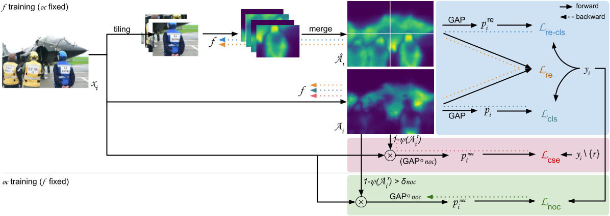

# P-NOC: Adversarial CAM Generation for Weakly Supervised Semantic Segmentation

## Introduction

This respository contains the official implementation for the paper
"P-NOC: Adversarial CAM Generation for Weakly Supervised Semantic Segmentation".

In summary, P-NOC is trained by alternatively optimizing two objectives:
```math
\begin{align}
    \mathcal{L}_f &= \mathbb{E}_{(x,y)\sim\mathcal{D},r\sim y}[\mathcal{L}_\text{P} + \lambda_\text{cse}\ell_\text{cls}(p^\text{oc}, y\setminus\{r\})] \\
    \mathcal{L}_\text{noc} &= \mathbb{E}_{(x,y)\sim\mathcal{D},r\sim y}[\lambda_\text{noc}\ell_\text{cls}(p^\text{noc}, y)]
\end{align}
```
where $p^\text{noc} = oc(x \circ (1 - \psi(A^r) > \delta_\text{noc}))$.



## Results
### Pascal VOC 2012 (test)

| Method | bg | a.plane | bike | bird  | boat  | bottle | bus   | car   | cat   | chair | cow   | d.table | dog   | horse | m.bike | person | p.plant | sheep | sofa  | train | tv | Overall |
| ---------- | ---------- | --------- | ------- | ----- | ----- | ------ | ----- | ----- | ----- | ----- | ----- | ----------- | ----- | ----- | --------- | ------ | ----------- | ----- | ----- | ----- | --------- | ------- |
| P-OC | 91.55      | 86.74     | 38.28   | 89.29 | 61.13 | 74.81  | 92.01 | 86.57 | 89.91 | 20.53 | 85.81 | 56.98       | 90.21 | 83.53 | 83.38     | 80.78  | 67.99       | 86.96 | 47.09 | 62.76 | 43.09     | 72.35   |
| P-NOC | 91.36      | 86.70     | 35.18   | 87.84 | 62.89 | 71.57  | 92.97 | 86.33 | 92.34 | 30.43 | 85.79 | 60.68       | 91.73 | 81.70 | 82.72     | 66.30  | 65.85       | 88.75 | 48.71 | 72.48 | 44.48     | 72.70   |

### MS COCO 2014 (val)

| Method | frisbee | skis | snowboard | sports ball | kite | baseball bat | baseball glove | skateboard | surfboard | tennis racket | bottle | wine glass | cup | fork | knife | spoon | bowl | banana | apple | sandwich | orange | broccoli | carrot | hot dog | pizza | donut | cake | chair | couch | potted plant | bed | dining table | toilet | tv | laptop | mouse | remote | keyboard | cell phone | microwave | oven | toaster | sink | refrigerator | book | clock | vase | scissors | teddy bear | hair drier | toothbrush | mIoU |
| ----- | ----- | ----- | ----- | ----- | ----- | ----- | ----- | ----- | ----- | ----- | ----- | ----- | ----- | ----- | ----- | ----- | ----- | ----- | ----- | ----- | ----- | ----- | ----- | ----- | ----- | ----- | ----- | ----- | ----- | ----- | ----- | ----- | ----- | ----- | ----- | ----- | ----- | ----- | ----- | ----- | ----- | ----- | ----- | ----- | ----- | ----- | ----- | ----- | ----- | ----- | ----- | ----- |
| P-NOC | 51.01 | 4.88 | 38.23 | 47.6 | 52.41 | 19.91 | 12.16 | 29.33 | 35.3 | 24.73 | 39.83 | 52.14 | 32.73 | 27.16 | 30.61 | 17.83 | 13.88 | 66.68 | 53.38 | 55.49 | 67.76 | 35.56 | 29.03 | 56.26 | 66.46 | 67.79 | 52.73 | 21.4 | 30.02 | 20.05 | 46.51 | 12.61 | 66.04 | 41.53 | 60.33 | 24.88 | 33.13 | 60.94 | 65.85 | 38.99 | 35.53 | 25.06 | 34.14 | 27.63 | 40.1 | 24.18 | 37.42 | 50.07 | 72.15 | 27.29 | 35.36 | 48.12 |

## Setup
Check the [SETUP.md](SETUP.md) file for information regarding the setup of the Pascal VOC 2012 and MS COCO 2014 datasets.

## Experiments

The scripts used for training P-NOC are available in the [runners](runners) folder.
Generally, they will run the following scripts, in this order:

### 0. Common Setup
```shell
ARCH=rs269
ARCHTECTURE=resnest269
B=32    # batch size
AC=1    # accumulate steps
## If memory requirements are too high: 
# B=16
# AC=2

# Pascal VOC 2012
# ===============
LR=0.1
LS=0.1  # label smoothing
DATASET=voc12
D_TRAIN=train_aug
D_VAL=val
DATA_DIR=/datasets/VOCdevkit/VOC2012

# MS COCO 2014
# ============
LR=0.05
LS=0  # label smoothing
DATASET=coco14
D_TRAIN=train2014
D_VAL=val2014
DATA_DIR=/datasets/coco14
```

### 1. Train classifiers and generate segmentation priors
```shell
# 1.1 Train Ordinary Classifier (OC).
OC_TAG=$DATASET-$ARCHra
OC_WEIGHTS=./experiments/models/$OC_TAG.pth

CUDA_VISIBLE_DEVICES=$DEVICES    \
$PY scripts/cam/train_vanilla.py \
  --tag             $OC_TAG      \
  --lr              $LR          \
  --batch_size      $B           \
  --architecture    $ARCHTECTURE \
  --augment         randaugment  \
  --label_smoothing $LS          \
  --dataset         $DATASET     \
  --data_dir        $DATA_DIR

# 1.2 Train Puzzle-Not So Ordinary Classifier (P-NOC).
PNOC_TAG=$DATASET-rs269pnoc@rs269ra
PNOC_CAMS=$PNOC_TAG@$D_TRAIN@scale=0.5,1.0,1.5,2.0

CUDA_VISIBLE_DEVICES=$DEVICES      \
$PY scripts/cam/train_pnoc.py      \
  --tag               $PNOC_TAG    \
  --lr                $LR          \
  --batch_size        $B           \
  --accumulate_steps  $AC          \
  --mixed_precision   true         \
  --augment           colorjitter  \
  --label_smoothing   $LS          \
  --oc-train-masks    cams         \
  --oc_train_mask_t   0.2          \
  --architecture      $ARCHTECTURE \
  --oc-architecture   $ARCHTECTURE \
  --oc-pretrained     $OC_WEIGHTS  \
  --dataset           $DATASET     \
  --data_dir          $DATA_DIR

# 1.3 Inference of CAMs with TTA.
CUDA_VISIBLE_DEVICES=$DEVICES $PY scripts/cam/inference.py --domain $D_TRAIN   \
  --architecture $ARCH --tag $PNOC_TAG --dataset $DATASET --data_dir $DATA_DIR
CUDA_VISIBLE_DEVICES=$DEVICES $PY scripts/cam/inference.py --domain $D_VAL     \
  --architecture $ARCH --tag $PNOC_TAG --dataset $DATASET --data_dir $DATA_DIR

# 1.4 (Optional) Evaluate CAM priors.
$PY scripts/evaluate.py --experiment_name $PNOC_CAMS --domain $D_TRAIN \
  --dataset $DATASET --data_dir $DATA_DIR --num_workers $WORKERS
```

### 2 Train CCAM and generate pseudo saliency masks
```shell
# 2.1 Train C²AM-H
B=256
AC=1
# If memory requirements too high:
B=128
AC=2

CCAMH_LR=0.001   # VOC12
CCAMH_LR=0.0005  # MSCOCO14

FG_T=0.3  # Might need fine-tuning. Usually a high value, inducing low FP for classes.
CCAMH_TAG=$DATASET-ccamh-rs269-fg$FG_T@rs269pnoc@rs269ra

CUDA_VISIBLE_DEVICES=$DEVICES       \
  $PY scripts/ccam/train_hints.py   \
  --tag                 $CCAMH_TAG  \
  --lr                  $CCAMH_LR   \
  --batch_size          $B          \
  --accumulate_steps    $AC         \
  --mixed_precision     true        \
  --architecture        $ARCHTECTURE \
  --stage4_out_features 1024        \
  --fg_threshold        $FG_T       \
  --cams_dir ./experiments/predictions/$PNOC_CAMS  \
  --dataset             $DATASET    \
  --data_dir            $DATA_DIR

# 2.2 Infer C²AM-H's saliency priorswith TTA:
CUDA_VISIBLE_DEVICES=$DEVICES $PY scripts/ccam/inference.py --tag $CCAMH_TAG \
  --architecture $ARCH --stage4_out_features 1024                            \
  --domain $D_TRAIN --dataset $DATASET --data_dir $DATA_DIR

CUDA_VISIBLE_DEVICES="" $PY scripts/ccam/inference_crf.py --experiment_name $CCAMH_TAG \
  --domain $D_TRAIN --dataset $DATASET --data_dir $DATA_DIR

# 2.3 Train PoolNet
PN_TAG=$DATASET-pn@ccamh@pnoc@ra
cd poolnet
OMP_NUM_THREADS=16 CUDA_VISIBLE_DEVICES=0 $PY main_voc.py --arch resnet --mode train --train_root $DATA_DIR --pseudo_root ../experiments/predictions/$CCAMH_TAG
OMP_NUM_THREADS=16 CUDA_VISIBLE_DEVICES=0 $PY main_voc.py --arch resnet --mode test --train_root $DATA_DIR --model ./results/path/to/your/saved/model --sal_folder ../experiments/predictions/$PN_TAG
cd ..
```

#### 3 Refining Priors with Random Walk
```shell
# 3.1 Creating Affinity Labels
FG=0.3
BG=0.1
CRF_T=10
CRF_GT=0.7
B=32
RW_TAG=$DATASET-an-fg$FG-bg$BG@pn@ccamh@pnoc@ra

CUDA_VISIBLE_DEVICES=""                 \
$PY scripts/rw/make_affinity_labels.py  \
    --tag          $RW_TAG              \
    --fg_threshold $FG                  \
    --bg_threshold $BG                  \
    --crf_t        $CRF_T               \
    --crf_gt_prob  $CRF_GT              \
    --cams_dir ./experiments/predictions/$PNOC_CAMS \
    --sal_dir  ./experiments/predictions/$PN_TAG    \
    --num_workers  $WORKERS             \
    --domain       $D_TRAIN             \
    --dataset      $DATASET             \
    --data_dir     $DATA_DIR

# 3.2 Train AffinityNet
CUDA_VISIBLE_DEVICES=$DEVICES    \
$PY scripts/rw/train_affinity.py \
    --tag          $RW_TAG       \
    --architecture $ARCHTECTURE  \
    --batch_size   $B            \
    --label_dir    ./experiments/predictions/$RW_TAG  \
    --dataset      $DATASET      \
    --data_dir     $DATA_DIR

# 3.3 Affinity Random Walk
CUDA_VISIBLE_DEVICES=$DEVICES $PY scripts/rw/inference.py --domain $D_TRAIN \
  --architecture $ARCH --model_name $RW_TAG --cam_dir $PNOC_TAG             \
  --beta 10 --exp_times 8 --dataset $DATASET --data_dir $DATA_DIR

CUDA_VISIBLE_DEVICES=$DEVICES $PY scripts/rw/inference.py --domain $D_VAL \
  --architecture $ARCH --model_name $RW_TAG --cam_dir $PNOC_TAG           \
  --beta 10 --exp_times 8 --dataset $DATASET --data_dir $DATA_DIR
```

#### 4 Train DeepLabV3+ and generate semantic segmentation predictions (optional)
```shell
# 4.1 Generate pseudo labels
T=0.3
CRF_T=1
CRF_P=0.9
RW_LABELS=$RW_TAG@beta=10@exp_times=8@rw@crf=$CRF_T

CUDA_VISIBLE_DEVICES="" $PY scripts/segmentation/make_pseudo_labels.py     \
  --experiment_name $RW_TAG@train@beta=10@exp_times=8@rw --domain $D_TRAIN \
  --threshold $T --crf_t $CRF_T --crf_gt_prob $CRF_P                       \
  --dataset $DATASET --data_dir $DATA_DIR                                  &
CUDA_VISIBLE_DEVICES="" $PY scripts/segmentation/make_pseudo_labels.py     \
  --experiment_name $RW_TAG@val@beta=10@exp_times=8@rw --domain $D_VAL     \
  --threshold $T --crf_t $CRF_T --crf_gt_prob $CRF_P                       \
  --dataset $DATASET --data_dir $DATA_DIR                                  &
wait

# Merge train and val pseudo labels into a single folder:
mkdir -p $RW_LABELS
mv $RW_TAG@train@beta=10@exp_times=8@rw@crf=1/* $RW_LABELS/
mv $RW_TAG@val@beta=10@exp_times=8@rw@crf=1/* $RW_LABELS/
rm $RW_TAG@train@beta=10@exp_times=8@rw@crf=1 $RW_TAG@val@beta=10@exp_times=8@rw@crf=1 -r

# 4.2 Train DeepLabV3+
SEGM_TAG=dlv3p-gn@an@pn@ccamh@rs269pnoc@rs269ra
B=32
AUG=colorjitter  # colorjitter_cutmix

CUDA_VISIBLE_DEVICES=$DEVICES     \
$PY scripts/segmentation/train.py \
    --tag             $SEGM_TAG   \
    --backbone        $ARCH       \
    --batch_size      $B          \
    --use_gn          true        \
    --mixed_precision true        \
    --augment         $AUG        \
    --label_smoothing $LS         \
    --label_name      $RW_LABELS  \
    --dataset         $DATASET    \
    --data_dir        $DATA_DIR

# 4.2 Inference with DeepLabV3+ and TTA:
DOMAIN=val
CUDA_VISIBLE_DEVICES=$DEVICES                                \
$PY scripts/segmentation/inference.py --tag $SEGM_TAG        \
  --backbone $ARCH --use_gn true --crf_t 1 --crf_gt_prob 0.9 \
  --dataset $DATASET --domain $DOMAIN --data_dir $DATA_DIR
```

## Acknowledgements

Much of the code here was borrowed from psa, OC-CSE, Puzzle-CAM and CCAM repositories.
We thank the authors for their considerable contributions and efforts.
